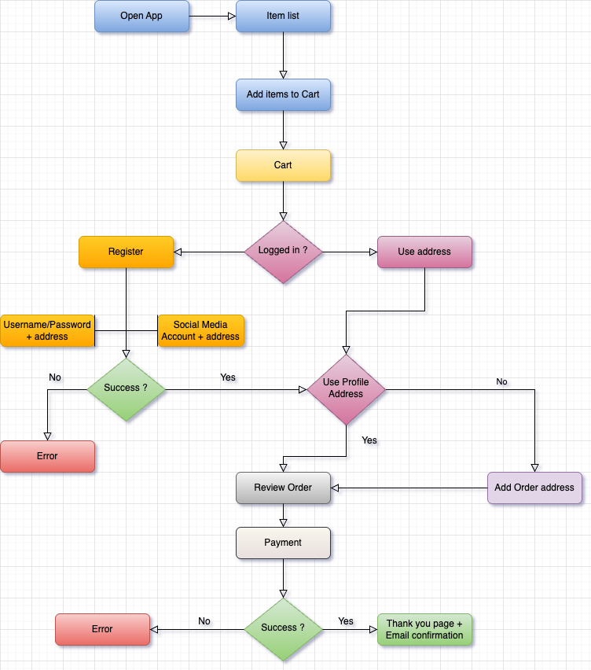

# 🍽️ The LateNighteShop-App

A mobile application built with **React Native** for ordering food online, with user authentication, cart management, and payment processing.

## 📱 Features

- Browse and search food items
- Add items to cart
- User authentication (login/register with social media or credentials)
- Address management
- Secure checkout and payment
- Order confirmation and email notifications

---

## 🔄 User Flow

The following diagram illustrates the user journey through the app:



---

## 🚀 Tech Stack

- **React Native** for the mobile UI
- **Zustand** for state management (if applicable)
- **Node.js / Express.js,** as backend
- **AWS** for authentication and backend services
- **Stripe** for payments
- **GitHub Actions / Expo** for deployment & CI/CD

---

## 🛠 Installation

```bash
git clone https://github.com/fedal-nl/latenightshop-mobileapp.git
cd latenightshop-mobileapp
npm install
npx expo start
```
